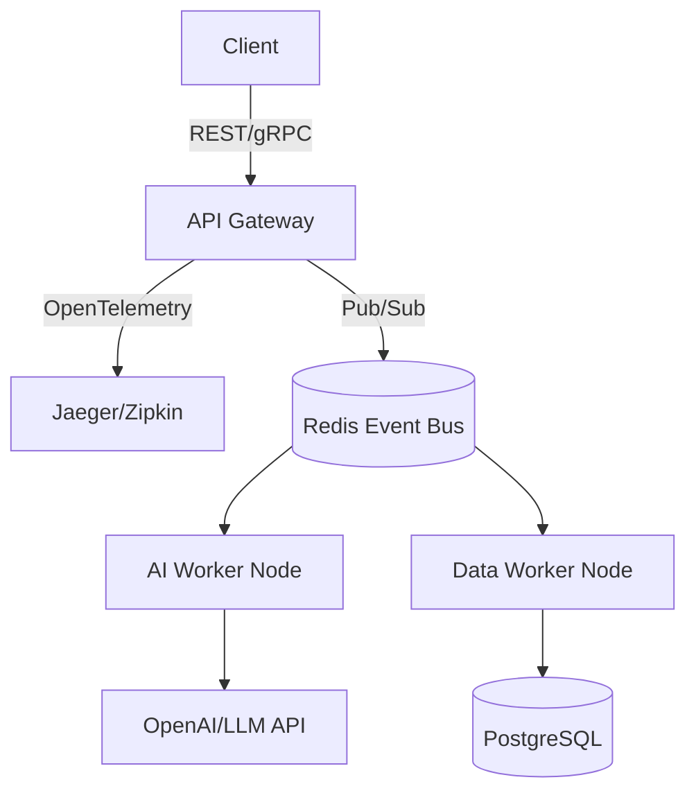

# Py-ML-Inference-Server


A production-grade inference server designed for sub-millisecond neural network forward passes, supporting TensorRT/ONNX backends.

## System Architecture





## Elite Features
- **Zero-Copy Arrays**: Numpy tensor memory mapping.
- **Sub-millisecond Latency**: Optimized FastAPI routing.
- **Telemetry**: Built-in latency tracking and model versioning.

## Quick Start
```bash
docker-compose up -d redis
pip install -r requirements.txt
pytest tests/ -v
uvicorn src.main:app --reload
```
